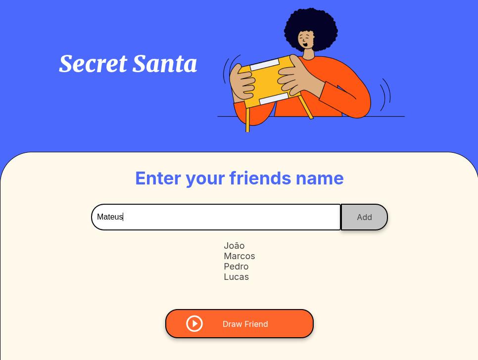
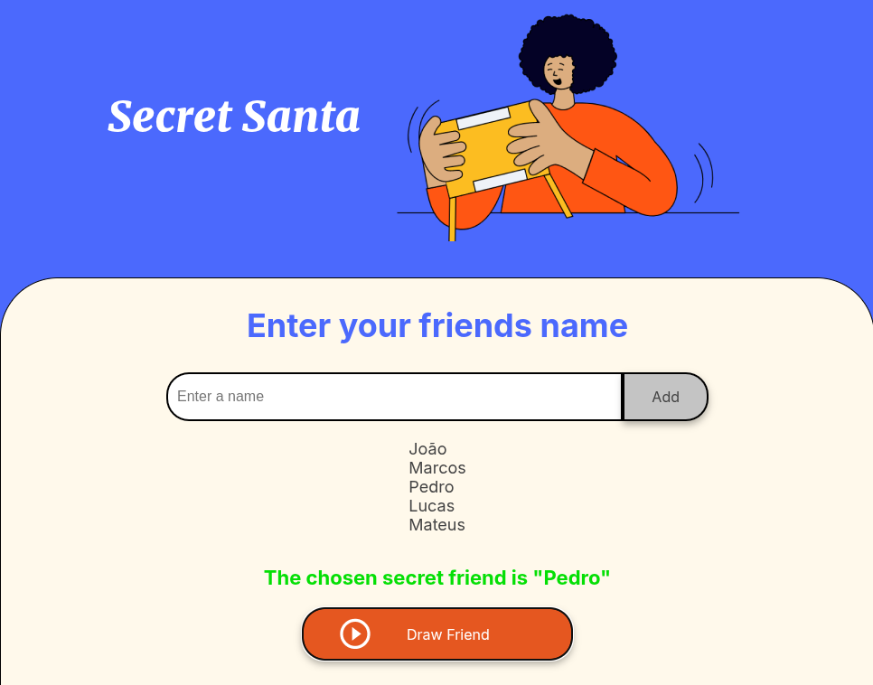

# Secret Santa

This project is a simple web application for organizing a Secret Santa event. Users can add friends' names to a list and randomly draw a name to determine the Secret Santa.

## Features

- Add friends' names to a list
- Randomly draw a name from the list
- Display the drawn name

## Technologies Used

- HTML
- CSS
- JavaScript

## Setup

1. Clone the repository - SSH:

   ```sh
   git clone git@github.com:juninolv/challenge-amigo-secreto_pt.git
   ```
   
2. Clone the repository - HTTPS:

    ```sh
    git clone https://github.com/juninolv/challenge-amigo-secreto_pt.git
    ```

3. Navigate to the project directory:
    ```sh
    cd challenge-amigo-secreto_pt
    ```

## Usage

1. Open `index.html` in your web browser.
2. Enter a friend's name in the input field and click the "Add" button to add the name to the list.
3. Click the "Draw Friend" button to randomly select a name from the list.

## Project Structure

- [index.html](index.html): The main HTML file containing the structure of the web page.
- [style.css](style.css): The CSS file for styling the web page.
- [app.js](app.js): The JavaScript file containing the logic for adding names and drawing a random name.

## Examples



